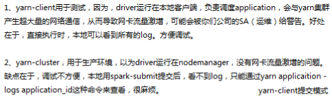

## 提交应用的脚本和可选参数

可以选择local模式下运行来测试程序，但要是在集群上运行还需要通过spark-submit脚本来完成。官方文档上的示例是这样写的（其中表明哪些是必要参数）：

```
./bin/spark-submit \
  --class <main-class> \
  --master <master-url> \
  --deploy-mode <deploy-mode> \
  --conf <key>=<value> \
  ... # other options
  <application-jar> \
  [application-arguments]
```

常用参数如下：
- `--master` 参数来设置 SparkContext 要连接的集群，默认不写就是local[*]【可以不用在SparkContext中写死master信息】

- `--jars` 来设置需要添加到 classpath 中的 JAR 包，有多个 JAR 包使用逗号分割符连接

- `--class` 指定程序的类入口

- `--deploy-mode` 指定部署模式，是在 worker 节点（cluster）上还是在本地作为一个外部的客户端（client）部署您的 driver（默认 : client）

  > 这里顺便提一下yarn-client和yarn-cluster区别
  

- `application-jar` : 包括您的应用以及所有依赖的一个打包的 Jar 的路径。该Jar包的 URL 在您的集群上必须是全局可见的，例如，一个 hdfs:// path 或者一个 file:// path 在所有节点是可见的。

- `application-arguments` : 传递到您的 main class 的 main 方法的参数

- `driver-memory`是 driver 使用的内存，不可超过单机的最大可使用的

- `num-executors`是创建多少个 executor

- `executor-memory`是各个 executor 使用的最大内存，不可超过单机的最大可使用内存

- `executor-cores`是每个 executor 最大可并发执行的 Task 数目

```
#如下是spark on yarn模式下运行计算Pi的测试程序
# 有一点务必注意，每行最后换行时务必多敲个空格，否则解析该语句时就是和下一句相连的，不知道会爆些什么古怪的错误
[hadoop@master spark-2.4.0-bin-hadoop2.6]$ ./bin/spark-submit \
> --master yarn \
> --class org.apache.spark.examples.SparkPi \
> --deploy-mode client \
> --driver-memory 1g \
> --num-executors 2 \
> --executor-memory 2g \
> --executor-cores 2 \
> examples/jars/spark-examples_2.11-2.4.0.jar \
> 10
```
每次提交都写这么多肯定麻烦，可以写个脚本

## 从文件中加载配置

**spark-submit** 脚本可以从一个 **properties** 文件加载默认的 [Spark configuration values](http://spark.apache.org/docs/latest/configuration.html) 并且传递它们到您的应用中去。默认情况下，它将从 **Spark** 目录下的 ***conf/spark-defaults.conf*** 读取配置。更多详细信息，请看 [加载默认配置](http://spark.apache.org/docs/latest/configuration.html#loading-default-configurations) 部分。

加载默认的 **Spark** 配置，这种方式可以消除某些标记到 **spark-submit** 的必要性。例如，如果 ***spark.master*** 属性被设置了，您可以在 **spark-submit** 中安全的省略。一般情况下，明确设置在 **SparkConf** 上的配置值的优先级最高，然后是传递给 **spark-submit** 的值，最后才是 **default value**（默认文件）中的值。

如果您不是很清楚其中的配置设置来自哪里，您可以通过使用 ***--verbose*** 选项来运行 **spark-submit** 打印出细粒度的调试信息

更多内容可参考文档：[提交应用](http://cwiki.apachecn.org/pages/viewpage.action?pageId=3539265) ，[Spark-Submit 参数设置说明和考虑](https://www.alibabacloud.com/help/zh/doc-detail/28124.htm)


## 配置参数优先级问题

sparkConf中配置的参数优先级最高，其次是spark-submit脚本中，最后是默认属性文件（spark-defaults.conf）中的配置参数

默认情况下，spark-submit也会从spark-defaults.conf中读取配置