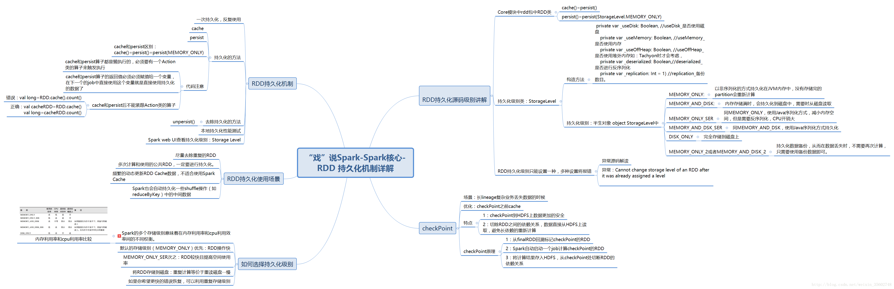

## 持久化

Spark的一个重要特性，对RDD持久化操作时每个节点将RDD中的分区持久化到内存（或磁盘）上，之后的对该RDD反复操作过程中不需要重新计算该RDD，而是直接从内存中调用已缓存的分区即可。
当然，持久化适用于将要多次计算反复调用的RDD。不然的话会出现RDD重复计算，浪费资源降低性能的情况

> 巧妙使用RDD持久化，甚至在某些场景下，可以将spark应用程序的性能提升10倍。对于迭代式算法和快速交互式应用来说，RDD持久化，是非常重要的

其次，持久化机制还有自动容错机制，如果哪个缓存的分区丢失，就会自动从其源RDD通过系列transformation操作重新计算该丢失分区

Spark的一些shuffle操作也会自动对中间数据进行持久化，避免了在shuffle出错情况下，需要重复计算整个输入

## 持久化方法

cache()和persist()方法，二者都是Transformation算子。要使用持久化必须将缓存好的RDD付给一个变量，之后重复使用该变量即可，其次不能在cache、persist后立刻调用action算子，否则也不叫持久化

cache()等同于只缓存在内存中的persist()，源码如下
```scala
def cache(): this.type = persist()
def persist(): this.type = persist(StorageLevel.MEMORY_ONLY)
```

另外persist持久化还有一个Storage Level的概念 【持久化策略】

| Storage Level                         | meaning                                                      |
| ------------------------------------- | ------------------------------------------------------------ |
| MEMORY_ONLY                           | 以非序列化的Java对象的方式持久化在JVM内存中。如果内存无法完全存储RDD所有的partition，那么那些没有持久化的partition就会在下一次需要使用它的时候，重新被计算 |
| MEMORY_AND_DISK                       | 先缓存到内存，但是当内存不够时，会持久化到磁盘中。下次需要使用这些partition时，需要从磁盘上读取 |
| MEMORY_ONLY_SER                       | 同MEMORY_ONLY，但是会使用Java序列化方式，将Java对象序列化后进行持久化。可以减少内存开销，但是需要进行反序列化，因此会加大CPU开销 |
| MEMORY_AND_DSK_SER                    | 同MEMORY_AND_DSK，_SER同上也会使用Java序列化方式             |
| DISK_ONLY                             | 使用非序列化Java对象的方式持久化，完全存储到磁盘上           |
| MEMORY_ONLY_2【或者其他尾部加了_2的】 | 尾部_2的级别会将持久化数据复制一份，保存到其他节点，从而在数据丢失时，不需要再次计算，只需要使用备份数据即可 |

上面提过持久化也是Transformation算子，所以也是遇到action算子才执行

```scala
final def iterator(split: Partition, context: TaskContext): Iterator[T] = {
    if (storageLevel != StorageLevel.NONE) {
      getOrCompute(split, context)
    } else {
      computeOrReadCheckpoint(split, context)
    }
  }
```

会根据StorageLevel判断是否是持久化的，getOrCompute 就是根据RDD的RDDBlockId作为BlockManager 的key，判断是否缓存过这个RDD，如果没有，通过依赖计算生成，然后放入到BlockManager 中。如果已经存在，则直接从BlockManager 获取

### 如何选择持久化策略

> Spark提供的多种持久化级别，主要是为了在CPU和内存消耗之间进行取舍。下面是一些通用的持久化级别的选择建议：
>
> 1、优先使用MEMORY_ONLY，如果可以缓存所有数据的话，那么就使用这种策略。因为纯内存速度最快，而且没有序列化，不需要消耗CPU进行反序列化操作。
> 2、如果MEMORY_ONLY策略，无法存储的下所有数据的话，那么使用MEMORY_ONLY_SER，将数据进行序列化进行存储，纯内存操作还是非常快，只是要消耗CPU进行反序列化。
> 3、如果需要进行快速的失败恢复，那么就选择带后缀为_2的策略，进行数据的备份，这样在失败时，就不需要重新计算了。
> 4、能不使用DISK相关的策略，就不用使用，有的时候，从磁盘读取数据，还不如重新计算一次。

### 非持久化方法  unpersist()


参考：https://blog.csdn.net/weixin_35602748/article/details/78667489 和北风网spark245讲



