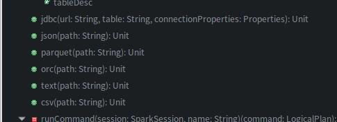

> 以下源码在 `org.apache.spark.sql.DataFrameReader/DataFrameWriter`中

### format指定内置数据源

无论是load还是save都可以手动指定用来操作的数据源类型，**format方法**，通过eclipse查看相关源码，spark内置支持的数据源包括parquet（默认）、json、csv、text（文本文件）、 jdbc、orc，如图



```scala
def format(source: String): DataFrameWriter[T] = {
    this.source = source
    this}

private var source: String = df.sparkSession.sessionState.conf.defaultDataSourceName

def defaultDataSourceName: String = getConf(DEFAULT_DATA_SOURCE_NAME)
// This is used to set the default data source，默认处理parquet格式数据
val DEFAULT_DATA_SOURCE_NAME = buildConf("spark.sql.sources.default")
    .doc("The default data source to use in input/output.")
    .stringConf
    .createWithDefault("parquet")
```

#### 列举csv方法使用

源码如下，可见其实本质就是format指定数据源再调用save方法保存

```scala
def csv(paths: String*): DataFrame = format("csv").load(paths : _*)		//可以指定多个文件或目录
def csv(path: String): Unit = {
    format("csv").save(path)
  }
```

可以看下我这篇文章：[Spark1.x和2.x如何读取和写入csv文件](https://blog.csdn.net/lzw2016/article/details/85562172#commentBox)

#### 可选的option方法

还有就是这几个内置数据源读取或保存的方法都有写可选功能方法option，比如csv方法可选功能有（截取部分自认为有用的）：

> You can set the following CSV-specific options to deal with CSV files:
>
> - **`sep` (default `,`): sets a single character as a separator for each field and value**.
> - `encoding` (default `UTF-8`): decodes the CSV files by the given encoding type.
> - **`escape` (default `\`):** sets a single character used for escaping quotes inside an already quoted value.
> - `comment` (default empty string): sets a single character used for skipping lines beginning with this character. By default, it is disabled.
> - **`header` (default `false`): uses the first line as names of columns.**
> - `enforceSchema` (default `true`): If it is set to `true`, the specified or inferred schema will be forcibly applied to datasource files, and headers in CSV files will be ignored. If the option is set to `false`, the schema will be validated against all headers in CSV files in the case when the `header` option is set to `true`. Field names in the schema and column names in CSV headers are checked by their positions taking into account`spark.sql.caseSensitive`. Though the default value is true, it is recommended to disable the `enforceSchema` option to avoid incorrect results.
> - `inferSchema` (default `false`): infers the input schema automatically from data. It requires one extra pass over the data.
> - `ignoreLeadingWhiteSpace` (default `false`): a flag indicating whether or not leading whitespaces from values being read should be skipped.
> - `ignoreTrailingWhiteSpace` (default `false`): a flag indicating whether or not trailing whitespaces from values being read should be skipped.
> - `nullValue` (default empty string): sets the string representation of a null value. Since 2.0.1, this applies to all supported types including the string type.
> - **`emptyValue` (default empty string):** sets the string representation of an empty value.
> - `maxColumns` (default `20480`): defines a hard limit of how many columns a record can have.
>
> 像eclipse、Idea这类编辑器可以通过鼠标移动到对应方法上查看可以用到哪些options

**有一点要注意：不要对该方法没有的option强加上**，比如text用上option("sep",";")

### SaveMode保存模式和mode方法


| **Save Mode**                 | **意义**                                                     |
| ----------------------------- | ------------------------------------------------------------ |
| SaveMode.ErrorIfExists (默认) | 如果目标位置已经存在数据，那么抛出一个异常（默认的SaveMode） |
| SaveMode.Append               | 如果目标位置已经存在数据，那么将数据追加进去                 |
| SaveMode.Overwrite            | 如果目标位置已经存在数据，那么就将已经存在的数据删除，用新数据进行覆盖 |
| SaveMode.Ignore               | 如果目标位置已经存在数据，那么就忽略，不做任何操作。         |

Scala中通过mode方法指定SaveMode，源码如下

```scala
def mode(saveMode: String): DataFrameWriter[T] = {
    this.mode = saveMode.toLowerCase(Locale.ROOT) match {
      case "overwrite" => SaveMode.Overwrite
      case "append" => SaveMode.Append
      case "ignore" => SaveMode.Ignore
      case "error" | "errorifexists" | "default" => SaveMode.ErrorIfExists
      case _ => throw new IllegalArgumentException(s"Unknown save mode: $saveMode. " +
        "Accepted save modes are 'overwrite', 'append', 'ignore', 'error', 'errorifexists'.")
    }
    this
  }
```

### 使用jdbc连接数据库

- 使用 **JDBC** 访问特定数据库时，需要在 **spark classpath** 上添加对应的 **JDBC** 驱动配置，可以放在Spark的library目录，也可以在使用Spark Submit的使用指定具体的Jar（编码和打包的时候都不需要这个JDBC的Jar）

  ```
  # 就是在spark-submit 脚本中加类似下方两个参数
  --jars $HOME/tools/mysql-connector-java-5.1.40/mysql-connector-java-5.1.40-bin.jar \
  --driver-class-path $HOME/tools/mysql-connector-java-5.1.40-bin.jar \
  ```

  当然，我查相关资料时也看到了如下添加驱动的配置

  > 第一种是在${SPARK_HOME}/conf目录下的spark-defaults.conf中添加：spark.jars /opt/lib/mysql-connector-java-5.1.26-bin.jar 
  >
  > 第二种是通过 添加 ：spark.driver.extraClassPath /opt/lib2/mysql-connector-java-5.1.26-bin.jar  这种方式也可以实现添加多个依赖jar，比较方便
  >
  > 参见：https://blog.csdn.net/u013468917/article/details/52748342 

- 写入数据库几点注意项  [参考](https://my.oschina.net/bindyy/blog/680195)

  - 操作该应用程序的用户有对相应数据库操作的权限
  - DataFrame应该转为RDD后，再通过foreachPartition操作把每一个partition插入数据库（不要用foreach，不然每条记录都会连接一次数据库）


```scala
spark.read.format("jdbc").option("url", "jdbc:mysql://localhost:3306/数据库").option("dbtable", "表名").option("user", "xxxx").option("password", "xxxx").option("driver", "com.mysql.jdbc.Driver").load()
```


首先，是通过SQLContext的read系列方法，将mysql中的数据加载为DataFrame
然后可以将DataFrame转换为RDD，使用Spark Core提供的各种算子进行操作
最后可以将得到的数据结果，通过foreach()算子，写入mysql、hbase、redis等等

### 保存为持久化的表

**DataFrames** 也可以通过 **saveAsTable** 命令来保存为一张持久表到 **Hive** **metastore** 中。值得注意的是对于这个功能来说已经存在的 **Hive** 部署不是必须的。**Spark** 将会为你创造一个默认的本地 **Hive metastore**（使用 **Derby**)。不像 **createOrReplaceTempView** 命令那样，**saveAsTable** 将会持久化 **DataFrame** 中的内容并在 **Hive metastore** 中创建一个指向数据的指针。持久化的表将会一直存在甚至当你的 **Spark** 应用已经重启，只要保持你的连接是和一个相同的 **metastore**。一个相对于持久化表的 **DataFrame** 可以通过在 **SparkSession** 中调用 **table** 方法创建。

默认情况下 **saveAsTable** 操作将会创建一个 “**managed table**”，意味着数据的位置将会被 **metastore** 控制。**Managed tables** 在表 **drop** 后也数据也会自动删除


### 注意项

- 不要对该方法没有的option强加上该option，比如text用上option("sep",";")，会报错
- 注意作为 **json file** 提供的文件不是一个典型的 **JSON** 文件。**每一行必须包含一个分开的独立的有效 JSON 对象**。因此，常规的多行 **JSON** 文件通常会失败