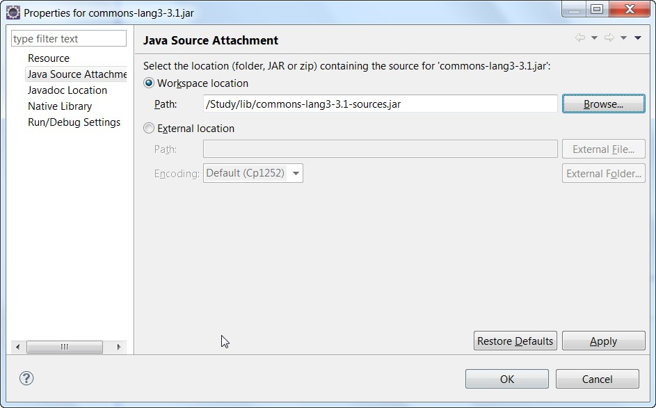

主要是在eclipse中不像idea一样查看Spark源码麻烦

### maven引入的jar

a:自动下载

  eclipse勾选windows->Preferences->Maven->Download Artifact Sources 这个选项,然后右键项目maven->maven update project就可以

 b.手动下载

使用maven命令行下载依赖包的源代码：

mvn dependency:sources mvn dependency

mvn dependency:sources -DdownloadSources=true -DdownloadJavadocs=true
   -DdownloadSources=true 下载源代码Jar -DdownloadJavadocs=true 下载javadoc包

如果执行后还是没有下载到，可以到仓库上搜一下，下载下来放到本地仓库，在eclise里面设置下关联就可以了。

### 其他jar

下载下来或者反编译出来再手动关联
   a:方法一 

     1. 按住Ctrl，用鼠标去点一些jar包里的方法，你可以选择跳转到implementation，
    
    2. 到时候它会有一个attach to source的选项，你点击，然后选择source的压缩包，就关联好了。

  b.方法二

    对jar包右击，选properties属性，进行关联

转载自：https://blog.csdn.net/qq_21209681/article/details/72917837 