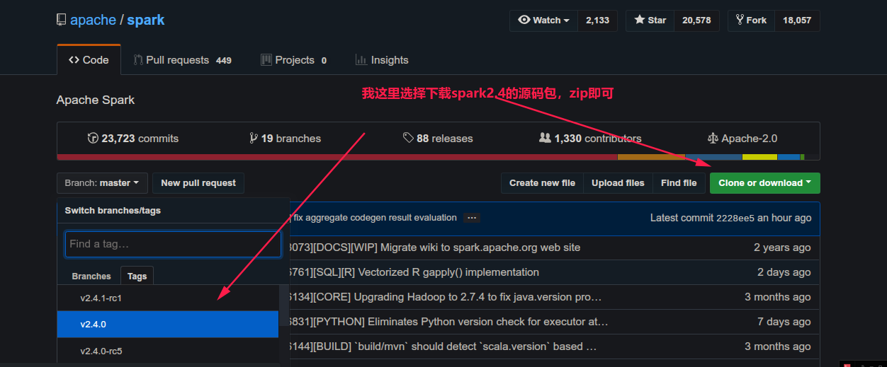
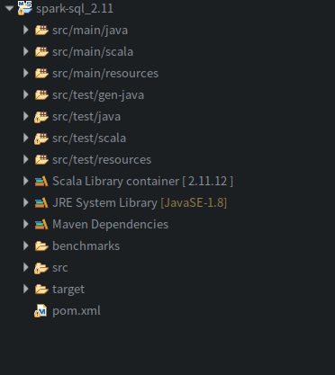

最近想看下spark sql的源码，就查了些相关文章。很多都是IDEA怎么导入的，还有就是谈到了自己编译spark源码再倒入，但我还没有强到修改源码的地步，所以跳过编译直接导入阅读源码，过程如下

### 下载spark源码

从 https://github.com/apache/spark 下载你需要的spark版本，如图

> 当然，也方便eclipse中 Ctrl+点击 来跳转到源码查看。具体是Attach Source中指定下载的源码所在位置即可
>
>   1. 按住Ctrl，用鼠标去点一些jar包里的方法，你可以选择跳转到implementation
>
>  2. 到时候它会有一个attach to source的选项，点击，然后选择下好的源码，就关联好了

### 导入eclipse

下载下来的项目是maven项目所以直接导入即可，当然eclipse要有安装maven插件

Eclipse中File->Import->Import Existing Maven Projects

如图，我下载并解压的源码包spark-2.4.0（为了区分，重命名了spark-2.4.0-src），导入然后选择你想要阅读的源码(不想要的下面取消勾选即可)

> Spark子项目模块有：
>
> - spark-catalyst：Spark的词法、语法分析、抽象语法树（AST）生成、优化器、生成逻辑执行计划、生成物理执行计划等。
> - spark-core：Spark最为基础和核心的功能模块。
> - spark-examples：使用多种语言，为Spark学习人员提供的应用例子。
> - spark-sql：Spark基于SQL标准，实现的通用查询引擎。
> - spark-hive：Spark基于Spark SQL，对Hive元数据、数据的支持。
> - spark-mesos：Spark对Mesos的支持模块。
> - spark-mllib：Spark的机器学习模块。
> - spark-streaming：Spark对流式计算的支持模块。
> - spark-unsafe：Spark对系统内存直接操作，以提升性能的模块。
> - spark-yarn：Spark对Yarn的支持模块。

点击Finish后，maven会自动下载相关依赖。没有自动下载的话，右键项目->Maven->Download Source->Update Project...即可

还有一个问题是可能最后会报错，比如有些jar包没有下载下来。我遇到的问题是，因为spark2.4.0是基于scala2.11的，但是我的eclipse插件较新下的是scala2.12，创建maven项目时会指定scala为2.12，所以依赖啥的可能就有问题吧（我猜测）。最后是在项目中指定scala2.11，maven会自动处理，然后就可以用了。

如图，我是导入了spark-sql源码

参考：

- https://ymgd.github.io/codereader/2018/04/16/Spark%E4%BB%A3%E7%A0%81%E7%BB%93%E6%9E%84%E5%8F%8A%E8%BD%BD%E5%85%A5Ecplise%E6%96%B9%E6%B3%95/
- http://www.cnblogs.com/zlslch/p/7457352.html